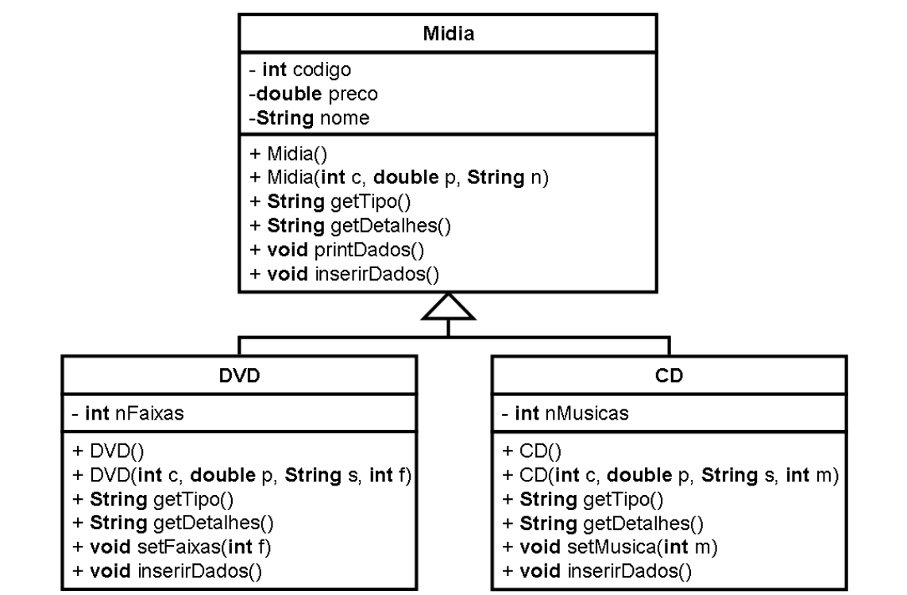

# Exercicio

## Exercicios sobre associação

1 - Uma loja que vende roupas possui um sistema capaz decontrolar a venda e o estoque.  Cada  roupa  possui  umcódigode  barras, um  tamanho  e  o  número  de exemplares  quea  lojapossui  daquela  roupa.Os  clientes  da  loja  são  cadastrados pelo nome.
Faça  um  diagrama  de  classe  que  modele  um  sistema  capaz  deresponderas perguntas abaixo:
- Quais foram as roupas compradas por um cliente?
- Quais são os clientesque já compraram uma determinada roupa?
- Quantos exemplares possuem de uma determinada roupa?

2 - Uma companhia de aviação gostaria de responder as seguintes questões sobre seus aviões:
- Qual é a capacidade em assentos de um Boeing 727?
- Quantos motores ele possui?
- Qual é a idade média dos aviões do tipo Boeing 727 da companhia?
- Quem é o mecânico-chefe responsável pela manutenção do avião numero 1388?
- Que companhia fabricou o avião com este número?

Construa  o diagrama  de  classes que  representa  os  dados  desta  companhia  de aviação,  incluindo  as  cardinalidades  (restrições  de  mapeamento),  nome e  direção dos relacionamentos.

3 - A editora PUC lançou vários livros em 2001 e 2002, os dados de alguns deles são descritos a seguir:
```
Título: Cálculo a uma Variável -Volume I -Uma Introdução ao Cálculo
Autores:Iaci Malta, Sinésio Pesco, Hélio Lopes
Número de páginas:478
Formato:16 x 23
Coleção:Matmídia

Título: Cálculo a uma Variável -Volume II -Derivada e Integral
Autores:Iaci Malta, Sinésio Pesco, Hélio Lopes
Número de páginas:309
Formato:16 x 23
Coleção:Matmídia

Título: Cálculo Integral a Várias Variáveis
Autores:Geovan Tavares e Marcos Craizer
Número de páginas:289
Formato:16 x 23
Coleção:Matmídia

Título:Às Margens: a propósito de Derrida
Autor:Paulo Cesar Duque-Estrada (org.)
Número de páginas:132
Formato:14 x 21
Coleção:Teologia e Ciências Humanas nº 4

Título: Antes de Marx -As raízes do Humanismo Cristão 
Autores:Pe. Fernando Bastos de Ávila
Número de páginas:300
Formato:14 x 21
Coleção:Clássicos nº 03Co-edição com a Academia Brasileira de Letrase EDUSC

Título:A dignidade da pessoa e os direitos humanos -O ser humano num mundo em transformação
Autor:Pe. Laércio Dias de Moura, S.J.
Número de páginas:292
Formato:14 x 21
Coleção: Co-edição entre Editora PUC-Rio, Edições Loyola e EDUSC
```

Construa o diagrama de classespara a Editora PUC.


## Exercicio sobre Herança

Exercício 1: Uma loja que vende CD e DVDS deseja construir um
cadastro com dos seus produtos. Para tanto, foi elaborado o diagrama
de classes dado na figura abaixo.


A tabela abaixo fornece uma descrição dos métodos que deverão ser
elaborados para cada uma das classes.

| Método 	| Descrição 	|
|---	|---	|
| getTipo() 	| Retorna uma String com o nome da classe. 	|
| getDetalhes() 	| Retorna uma String com as informações contidas nos campos. 	|
| printDados() 	| Imprime as informações contidas nos campos da classe. Para tanto, usa dois métodos para recuperar estas informações: getTipo() e getDetalhes(). Estas funções por sua vez são polimórficas, ou seja, seu tipo retorno varia de acordo com a classe escolhida, tal que estemétodo é sobreposto nas subclasses. 	|
| inserirDados() 	| Insere os dados necessários para se preencher os campos de um objeto de uma dada classe. Seu comportamento é polimórfico. 	|

Além dos métodos descritos na tabela a cima, deverão ser criados os métodos get e set correspondentes para retorna e modificar o conteúdo dos campos, respectivamente, bem como os construtores com e sem parâmetros de cada classe. Criar um programa que simule o uso de um cadastro de CD e DVDs.